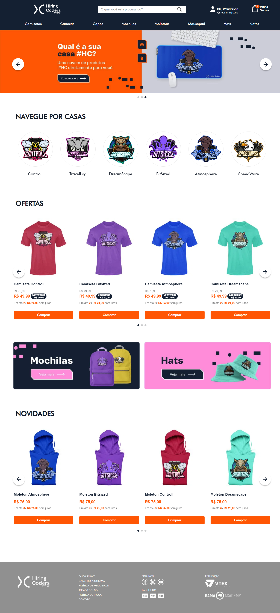

<h1 align="center">
    Hiring Coders Store Theme
</h1>

## 💻 Sobre o projeto

Tema de Loja VTEX IO para o Hiring Coders, com produtos com a temática das Casas do Programa.

## 🛠 Tecnologias/Ferramentas

As seguintes tecnologias/ferramentas foram usadas na construção do projeto:

- Figma (consulte o Layout [aqui](https://www.figma.com/file/CA7Mbiqwfd6uDUfAHFcgY8/Hiring-Coders-Controll-03---Wireframe?node-id=0%3A1))
- VTEX IO
- React

## ⚙️ Executando
- vtex login {sua conta}
- vtex use {seu workspace}
- vtex link

## ✨ Desenvolvido por:

- Douglas Rodrigues
- Allysson Fernando
- Suélen Dias
- Igor Santos
- Alessandra Buzios
- Fernando Beça
- Rômulo Guilherme
- Andressa Santana

## 🚀 Preview

